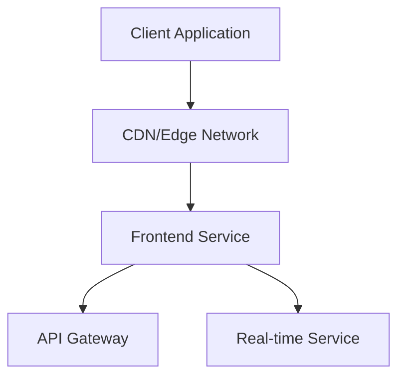
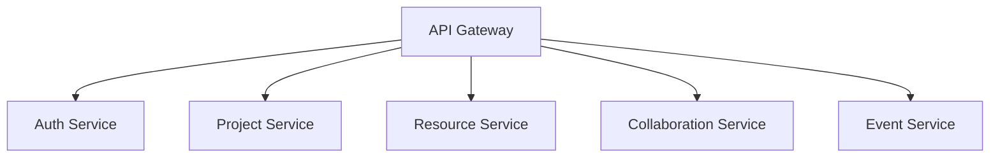
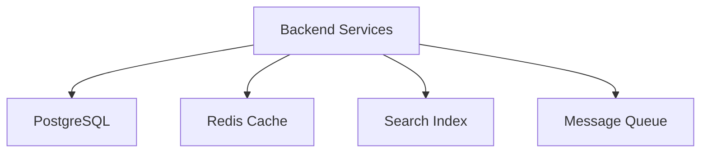
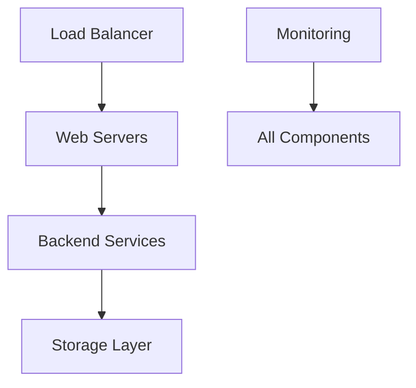

# NEPLUS System Architecture

## Overview

NEPLUS is built on a modern, scalable architecture designed to support decentralized collaboration and project management. The architecture follows microservices principles while maintaining simplicity and reliability.

## Core Components

### 1. Frontend Layer

- **React SPA**
  - Server-side rendering for improved performance
  - Code splitting and lazy loading
  - PWA capabilities for offline support
  - Optimized bundle size with tree shaking

- **State Management**
  - Zustand for global state
  - React Query for server state
  - Local storage for persistence

- **Performance Optimizations**
  - Asset preloading
  - Image optimization
  - Caching strategies
  - Service worker implementation

### 2. Backend Services

- **API Gateway**
  - Request routing
  - Rate limiting
  - Request/response transformation
  - API versioning
  - Documentation (OpenAPI)

- **Authentication Service**
  - JWT-based auth
  - Role-based access control
  - Session management
  - OAuth integration

- **Project Service**
  - Project CRUD operations
  - Team management
  - Progress tracking
  - Resource allocation

- **Resource Service**
  - Resource management
  - Exchange mechanisms
  - Availability tracking
  - Matching algorithms

- **Collaboration Service**
  - Real-time collaboration
  - Document sharing
  - Version control
  - Activity tracking

### 3. Data Layer

- **PostgreSQL Database**
  - Primary data store
  - Complex relationships
  - ACID compliance
  - Row-level security

- **Redis Cache**
  - Session storage
  - Rate limiting
  - Real-time data
  - Leaderboards

- **Search Service**
  - Full-text search
  - Faceted search
  - Relevance scoring
  - Auto-complete

- **Message Queue**
  - Event processing
  - Background jobs
  - Notifications
  - Service communication

### 4. Infrastructure

- **Deployment**
  - Container orchestration
  - Auto-scaling
  - Rolling updates
  - Health checks

- **Monitoring**
  - Performance metrics
  - Error tracking
  - User analytics
  - System health

- **Security**
  - SSL/TLS encryption
  - DDoS protection
  - WAF integration
  - Regular security audits

## Scalability Considerations

1. **Horizontal Scaling**
   - Stateless services
   - Load balancing
   - Database sharding
   - Caching strategies

2. **Performance**
   - Query optimization
   - Connection pooling
   - Asset optimization
   - CDN utilization

3. **Reliability**
   - Circuit breakers
   - Retry mechanisms
   - Fallback strategies
   - Data replication

4. **Maintainability**
   - Modular design
   - Clean architecture
   - Comprehensive testing
   - Documentation

## Security Architecture

1. **Authentication**
   - JWT tokens
   - Refresh token rotation
   - MFA support
   - Session management

2. **Authorization**
   - RBAC system
   - Resource-level permissions
   - API scopes
   - Audit logging

3. **Data Protection**
   - Encryption at rest
   - Encryption in transit
   - Data backups
   - Privacy controls

## Development Workflow

1. **Version Control**
   - Feature branches
   - Pull requests
   - Code review
   - Automated testing

2. **CI/CD**
   - Automated builds
   - Test automation
   - Deployment automation
   - Environment management

3. **Quality Assurance**
   - Unit testing
   - Integration testing
   - E2E testing
   - Performance testing

## Future Considerations

1. **Blockchain Integration**
   - Smart contracts
   - Token economics
   - Decentralized storage
   - Cross-chain compatibility

2. **AI/ML Capabilities**
   - Recommendation systems
   - Predictive analytics
   - Natural language processing
   - Computer vision

3. **Platform Evolution**
   - API extensibility
   - Plugin system
   - Third-party integrations
   - Mobile applications

## Monitoring and Observability

1. **Metrics Collection**
   - System metrics
   - Business metrics
   - User metrics
   - Performance metrics

2. **Logging**
   - Centralized logging
   - Log aggregation
   - Error tracking
   - Audit trails

3. **Alerting**
   - Alert thresholds
   - Alert routing
   - Incident management
   - On-call rotation

## Disaster Recovery

1. **Backup Strategy**
   - Regular backups
   - Point-in-time recovery
   - Geo-replication
   - Backup testing

2. **Recovery Plans**
   - RTO objectives
   - RPO objectives
   - Failover procedures
   - Recovery testing

## Conclusion

This architecture is designed to provide a robust foundation for NEPLUS while maintaining flexibility for future growth. Regular reviews and updates will ensure it continues to meet evolving needs.